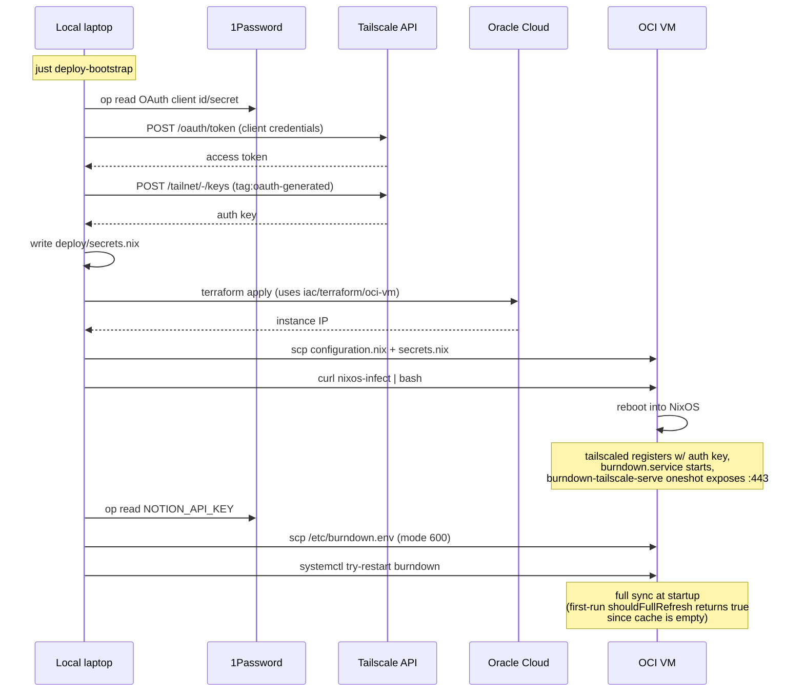
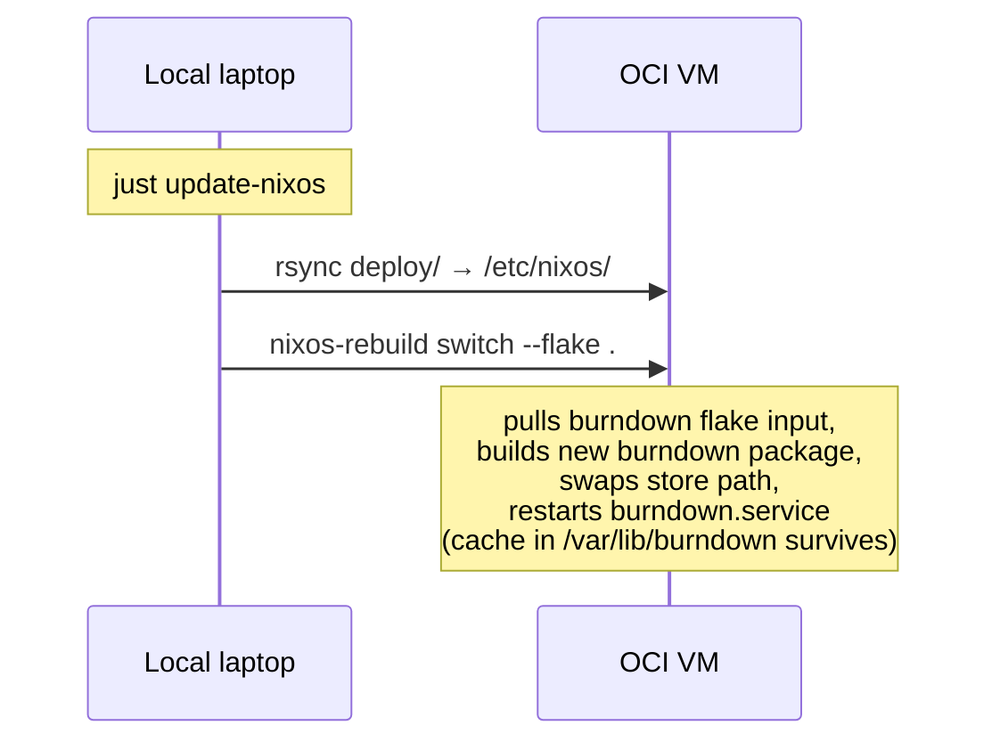

# Deploy burndown to OCI as a NixOS service via composable flake modules

**Status:** Draft — awaiting user approval
**Date:** 2026-05-21
**Scope:** Migrate the Notion task burndown chart off the Raspberry Pi onto an Oracle Cloud Always Free ARM VM. In the process, factor existing OCI deployments into reusable NixOS flake modules so future service VMs are just "import a module + flip `enable = true`."

## Goals

1. Burndown runs on an OCI Always Free ARM VM (`us-ashburn-1`, 1 OCPU / 6 GB / 50 GB) registered to the tailnet under hostname `notion-task-burndown-chart`, reachable at `https://notion-task-burndown-chart.tailee59b5.ts.net` via `tailscale serve` on HTTPS 443.
2. Build is hermetic via Nix: a flake-defined derivation produces the SvelteKit `build/` artifact reproducibly from `deno.lock`, with no local Pi-style "build-on-Mac-then-rsync" step.
3. Production runtime stays on Deno (matches global preference); local dev unchanged (`deno task dev`).
4. `nixos-ocp-tailscale-vm-iac` becomes a pure library: a `nixosModules.base` flake output (SSH, tailscale daemon, firewall basics) plus a Terraform module under `terraform/oci-vm/` that any service can consume.
5. Exit-node specifics extracted to a new repo `tailscale-exit-node-nixos-module` (created via `gh repo create`) exporting `nixosModules.default`.
6. `change-detection-deployment/` renamed to `changedetection.io-tailscale-nixos-module/`, internal structure split into `nix/` (module) + `deploy/` (Terraform + wire-it flake), with the duplicated bare-NixOS/Terraform bits replaced by imports from `nixos-ocp-tailscale-vm-iac`.
7. Pi deployment fully decommissioned after OCP cutover.

## Non-goals

- No agenix/sops-nix. Secrets stay file-based via systemd `EnvironmentFile`, pushed out of band by a justfile recipe reading from 1Password (same model as today).
- No automated `tag:oauth-generated` ACL bootstrap (already present in the tailnet per the global CLAUDE.md note).
- No CI-driven deploys. `just deploy-bootstrap` / `just update-nixos` from the developer's laptop only.
- No funnel for burndown (personal Notion data — tailnet-only).
- No Nix-built changedetection package (it's containers; nothing to build).
- No multi-arch publishing beyond what `nix build` happens to produce locally.

## Decision summary

| Decision | Choice |
|---|---|
| VM topology | New dedicated OCI VM for burndown |
| Region / size | `us-ashburn-1`, 1 OCPU / 6 GB / 50 GB boot |
| Tailnet hostname | `notion-task-burndown-chart` |
| Tailscale exposure | `tailscale serve` on HTTPS 443 (tailnet only) |
| Code-location pattern | Each service repo owns its own `deploy/` stack; `nixos-ocp-tailscale-vm-iac` is pure library |
| Secrets | systemd `EnvironmentFile=/etc/burndown.env`, pushed via justfile from 1Password |
| Tailscale auth key | Minted via OAuth client (1Password) → `tag:oauth-generated` |
| Build runtime | Deno (end-to-end) |
| Build hermeticity | Fixed-output derivation for deps (hash pinned to `deno.lock`) + sandboxed build with `--cached-only` |
| Cache file location | `/var/lib/burndown/notion-cache.json` (via systemd `StateDirectory=burndown`) |
| Cache-path injection | New `BURNDOWN_CACHE_PATH` env var read by `cache.ts` |
| Repo rename | `change-detection-deployment` → `changedetection.io-tailscale-nixos-module` |
| New repo | `tailscale-exit-node-nixos-module` (gh CLI) |
| Existing IaC repo | Keeps name `nixos-ocp-tailscale-vm-iac` |

## Repo topology

```
nixos-ocp-tailscale-vm-iac/                       # library, refactored
├── flake.nix                                     # exports nixosModules.base
├── modules/
│   └── base.nix                                  # SSH, tailscale daemon, firewall basics
└── terraform/
    └── oci-vm/                                   # reusable Terraform module
        ├── main.tf
        ├── variables.tf
        └── outputs.tf

tailscale-exit-node-nixos-module/                 # NEW (gh repo create)
├── flake.nix                                     # exports nixosModules.default
└── module.nix                                    # NAT/masq, --advertise-exit-node

changedetection.io-tailscale-nixos-module/        # renamed from change-detection-deployment
├── nix/
│   ├── flake.nix                                 # exports nixosModules.default
│   └── module.nix                                # Podman containers + funnel
└── deploy/
    ├── flake.nix                                 # wires base + cd module
    ├── main.tf                                   # uses module "vm" from IaC repo
    ├── hardware-configuration.nix
    ├── secrets.nix                               # gitignored
    └── justfile

notion-task-burndown-chart/                       # existing repo, additions
├── src/...                                       # unchanged
├── deno.json, deno.lock                          # unchanged
├── package.json                                  # unchanged
├── nix/                                          # NEW
│   ├── flake.nix                                 # exports packages.default + nixosModules.default
│   ├── package.nix                               # hermetic Deno build
│   └── module.nix                                # systemd unit + tailscale serve
└── deploy/                                       # REPLACES current Pi-targeted deploy/
    ├── flake.nix                                 # wires base + burndown module
    ├── main.tf                                   # uses module "vm" from IaC repo
    ├── hardware-configuration.nix
    ├── secrets.nix                               # gitignored — tailscale auth key
    ├── .deploy.env                               # gitignored
    └── justfile
```

## Per-repo design

### `nixos-ocp-tailscale-vm-iac` (library)

**`flake.nix` outputs:**
- `nixosModules.base` — the systemd/tailscale/SSH/firewall baseline
- (Terraform module is consumed via `git::` source, not a flake output)

**`modules/base.nix`** declares (without options — these are baked-in defaults):
- `services.openssh` enabled; `PermitRootLogin = "prohibit-password"`; `PasswordAuthentication = false`
- `services.tailscale` enabled; `useRoutingFeatures = "server"`; `authKeyFile` conditionally from a `secrets.nix` placed at `/etc/nixos/secrets.nix` on the VM
- `networking.firewall`: TCP 22, Tailscale UDP, `tailscale0` trusted, `checkReversePath = "loose"`
- `networking.useDHCP = true`
- `system.autoUpgrade.enable = true; allowReboot = false`
- `system.stateVersion = "25.11"` (immutable)
- Root SSH key authorized (Alex's ed25519 key, same as today)
- `time.timeZone` exposed as an option (default `"UTC"`; deploy stacks override)
- `networking.hostName` left unset — each deploy stack provides it

**`terraform/oci-vm/`** module accepts variables (with sensible defaults matching Always Free):
- `compartment_id` (required)
- `region` (default `us-ashburn-1`)
- `vcn_cidr` (default `10.0.0.0/16`) — service VMs override to avoid overlap (burndown: `10.0.0.0/16`, changedetection: `10.1.0.0/16`)
- `shape` (default `VM.Standard.A1.Flex`)
- `ocpus`, `memory_gb`, `boot_volume_size_gb` (defaults `1`, `6`, `50`)
- `display_name`, `ssh_public_key`

Outputs:
- `instance_public_ip`
- `instance_ocid`

The Terraform module body is essentially the current `main.tf` parameterized.

### `tailscale-exit-node-nixos-module` (NEW)

**`flake.nix`** exports `nixosModules.default = ./module.nix;`.

**`module.nix`:**
```nix
{ config, lib, ... }:
let cfg = config.services.tailscale-exit-node; in {
  options.services.tailscale-exit-node = {
    enable = lib.mkEnableOption "Tailscale exit node";
    externalInterface = lib.mkOption {
      type = lib.types.str;
      default = "ens3";  # OCI VM default
      description = "WAN-facing interface for NAT masquerade.";
    };
  };
  config = lib.mkIf cfg.enable {
    networking.nat = {
      enable = true;
      externalInterface = cfg.externalInterface;
      internalInterfaces = [ "tailscale0" ];
    };
    services.tailscale.extraUpFlags = [ "--advertise-exit-node" ];
  };
}
```

No deploy stack lives here — this is a pure module repo. To use it, a service VM's deploy `flake.nix` imports it as an input and adds `{ services.tailscale-exit-node.enable = true; }` to its module list.

### `changedetection.io-tailscale-nixos-module`

**`nix/module.nix`** exposes:
```nix
options.services.changedetection = {
  enable = lib.mkEnableOption "changedetection.io stack";
  baseUrl = lib.mkOption { type = lib.types.str; };       # https://<host>.<tailnet>.ts.net
  funnel = lib.mkOption { type = lib.types.bool; default = true; };
  timezone = lib.mkOption { type = lib.types.str; default = "America/New_York"; };
  containerNetwork = lib.mkOption { type = lib.types.str; default = "changedetection-net"; };
};
```

Body lifted ~1:1 from the current `change-detection-deployment/configuration.nix`. `baseUrl` defaults to `https://changedetection.tailee59b5.ts.net` for backward parity.
- `virtualisation.podman` + `oci-containers.backend = "podman"`
- Containers: `changedetection` and `browser-chrome` with their env vars + ports + volumes
- Podman-network oneshot service
- Optional tailscale-funnel oneshot (gated by `cfg.funnel`)

**`deploy/`** is the new home for what was top-level in the old repo. `flake.nix` imports `nixos-ocp-tailscale-vm-iac.nixosModules.base` and `self.nixosModules.default`, sets `networking.hostName = "changedetection"`, wires `services.changedetection.enable = true; baseUrl = "https://changedetection.<tailnet>.ts.net";`.

`deploy/main.tf` becomes:
```hcl
module "vm" {
  source = "git::https://github.com/<user>/nixos-ocp-tailscale-vm-iac.git//terraform/oci-vm?ref=main"

  compartment_id      = local.compartment_ocid
  region              = "us-ashburn-1"
  vcn_cidr            = "10.1.0.0/16"
  ocpus               = 2
  memory_gb           = 12
  boot_volume_size_gb = 50
  display_name        = "changedetection-vm"
  ssh_public_key      = var.ssh_public_key
}

output "instance_public_ip" {
  value = module.vm.instance_public_ip
}
```

### `notion-task-burndown-chart`

#### Source-level changes

**`src/lib/server/cache.ts`** — single edit: read cache path from env, fall back to `./notion-cache.json` for dev compatibility.

```ts
const CACHE_PATH = Deno.env.get("BURNDOWN_CACHE_PATH") ?? "./notion-cache.json";
```

Replace existing path literal references with `CACHE_PATH`.

**`CLAUDE.md`** — update the "Deployment" section to describe OCI flow; delete Pi-specific content.

**`deploy/`** — old Pi files removed (`burndown.service.template`, `setup.sh`), replaced by the OCI deploy stack described below.

#### `nix/package.nix` — hermetic Deno build

Two derivations: fixed-output dep cache, then sandboxed build using it.

```nix
{ pkgs, lib }:
let
  src = ../.;

  denoCache = pkgs.stdenv.mkDerivation {
    pname = "burndown-deno-cache";
    version = "0.1.0";
    inherit src;
    nativeBuildInputs = [ pkgs.deno ];

    outputHashMode = "recursive";
    outputHashAlgo = "sha256";
    outputHash = lib.fakeHash;            # set on first build; updates only on deno.lock change

    buildPhase = ''
      runHook preBuild
      export DENO_DIR=$out/.deno
      export HOME=$TMPDIR
      mkdir -p $out
      cd $TMPDIR
      cp -r $src/. .
      deno install --allow-scripts --frozen
      cp -r node_modules $out/node_modules
      runHook postBuild
    '';

    installPhase = "true";
    dontStrip = true;
    dontFixup = true;
  };
in
pkgs.stdenv.mkDerivation {
  pname = "notion-task-burndown-chart";
  version = (lib.importJSON ../package.json).version or "0.1.0";
  inherit src;
  nativeBuildInputs = [ pkgs.deno ];

  buildPhase = ''
    runHook preBuild
    export DENO_DIR=${denoCache}/.deno
    cp -r ${denoCache}/node_modules ./node_modules
    chmod -R +w node_modules
    deno run --cached-only -A npm:vite build
    runHook postBuild
  '';

  installPhase = ''
    runHook preInstall
    mkdir -p $out
    cp -r build $out/build
    cp -r node_modules $out/node_modules
    cp package.json deno.json deno.lock $out/
    runHook postInstall
  '';
}
```

#### `nix/module.nix` — systemd unit

```nix
{ self }:
{ config, lib, pkgs, ... }:
let cfg = config.services.burndown; in {
  options.services.burndown = {
    enable = lib.mkEnableOption "Notion task burndown chart";
    package = lib.mkOption {
      type = lib.types.package;
      default = self.packages.${pkgs.system}.default;
    };
    port = lib.mkOption { type = lib.types.port; default = 3000; };
    origin = lib.mkOption { type = lib.types.str; };
    envFile = lib.mkOption { type = lib.types.path; default = "/etc/burndown.env"; };
    tailscaleServe = lib.mkOption { type = lib.types.bool; default = true; };
    serveHttpsPort = lib.mkOption { type = lib.types.port; default = 443; };
  };
  config = lib.mkIf cfg.enable {
    systemd.services.burndown = {
      description = "Notion task burndown chart";
      after = [ "network.target" "tailscaled.service" ];
      wants = [ "tailscaled.service" ];
      wantedBy = [ "multi-user.target" ];
      serviceConfig = {
        Type = "simple";
        WorkingDirectory = cfg.package;
        StateDirectory = "burndown";                    # /var/lib/burndown, auto-created
        Environment = [
          "PORT=${toString cfg.port}"
          "HOST=127.0.0.1"
          "ORIGIN=${cfg.origin}"
          "BURNDOWN_CACHE_PATH=/var/lib/burndown/notion-cache.json"
        ];
        EnvironmentFile = cfg.envFile;
        ExecStart = "${pkgs.deno}/bin/deno run -A build/index.js";
        Restart = "on-failure";
        RestartSec = 5;
        DynamicUser = true;
      };
    };

    systemd.services.burndown-tailscale-serve = lib.mkIf cfg.tailscaleServe {
      description = "Configure tailscale serve for burndown";
      after = [ "tailscaled.service" "burndown.service" ];
      wants = [ "tailscaled.service" ];
      wantedBy = [ "multi-user.target" ];
      path = [ pkgs.tailscale pkgs.jq ];
      script = ''
        while ! tailscale status --json 2>/dev/null | jq -e '.Self.Online' > /dev/null 2>&1; do
          sleep 5
        done
        tailscale serve --bg --yes --https=${toString cfg.serveHttpsPort} \
          http://localhost:${toString cfg.port}
      '';
      serviceConfig = { Type = "oneshot"; RemainAfterExit = true; };
    };
  };
}
```

#### `nix/flake.nix`

```nix
{
  description = "Notion task burndown chart — service module + hermetic build";
  inputs.nixpkgs.url = "github:NixOS/nixpkgs/nixos-25.11";
  outputs = { self, nixpkgs }:
    let
      systems = [ "aarch64-linux" "x86_64-linux" "aarch64-darwin" "x86_64-darwin" ];
      forAll = nixpkgs.lib.genAttrs systems;
    in {
      packages = forAll (sys: {
        default = nixpkgs.legacyPackages.${sys}.callPackage ./package.nix { };
      });
      nixosModules.default = import ./module.nix { inherit self; };
    };
}
```

#### `deploy/` stack

**`deploy/flake.nix`** wires base + burndown service + hardware config into `nixosConfigurations.notion-task-burndown-chart`. Inputs: nixpkgs, the IaC repo (for `nixosModules.base`), the burndown repo's own `nix/` flake (path input during dev, github input for production).

```nix
{
  inputs = {
    nixpkgs.url = "github:NixOS/nixpkgs/nixos-25.11";
    iac.url   = "github:<user>/nixos-ocp-tailscale-vm-iac";
    burndown.url = "path:../nix";
  };
  outputs = { self, nixpkgs, iac, burndown, ... }: {
    nixosConfigurations.notion-task-burndown-chart =
      nixpkgs.lib.nixosSystem {
        system = "aarch64-linux";
        modules = [
          ./hardware-configuration.nix
          iac.nixosModules.base
          burndown.nixosModules.default
          ({ ... }: {
            networking.hostName = "notion-task-burndown-chart";
            time.timeZone = "America/New_York";
            services.burndown = {
              enable = true;
              origin = "https://notion-task-burndown-chart.tailee59b5.ts.net";
            };
          })
        ];
      };
  };
}
```

**`deploy/main.tf`** — Terraform consuming the IaC module:
```hcl
module "vm" {
  source = "git::https://github.com/<user>/nixos-ocp-tailscale-vm-iac.git//terraform/oci-vm?ref=main"

  compartment_id      = local.compartment_ocid
  region              = "us-ashburn-1"
  vcn_cidr            = "10.0.0.0/16"
  ocpus               = 1
  memory_gb           = 6
  boot_volume_size_gb = 50
  display_name        = "notion-task-burndown-chart"
  ssh_public_key      = var.ssh_public_key
}

output "instance_public_ip" { value = module.vm.instance_public_ip }
```

**`deploy/.deploy.env.example`** (gitignore the real one):
```
SECRET_PATH="op://Personal/Notion Task Burndown Chart Notion Internal Integration Secret/credential"
```

**`deploy/justfile`** recipes (new):
- `mint-tailscale-key` — OAuth → API → writes `deploy/secrets.nix` (see below)
- `apply` — `terraform apply`
- `oci-auth`, `init`, `plan`, `destroy` — standard wrappers
- `install-infect` — scp `configuration.nix` (and inlined flake refs) + `secrets.nix` to fresh Ubuntu, run nixos-infect
- `fetch-hardware-config` — pull `hardware-configuration.nix` after first install
- `update-nixos` — rsync flake to VM, `nixos-rebuild switch --flake .#notion-task-burndown-chart`
- `set-secret` — read `op://...` for `NOTION_API_KEY`, write `/etc/burndown.env` (mode 600), `try-restart burndown.service`
- `deploy-bootstrap` — full first-deploy sequence: `mint-tailscale-key` → `apply` → wait → `install-infect` → `fetch-hardware-config` → commit → `update-nixos` (to apply latest module changes) → `set-secret`
- `logs`, `status`, `ssh`

## Deploy flow



After bootstrap, the routine update loop is:



## Tailscale auth key minter

`deploy/justfile` recipe `mint-tailscale-key`:

```bash
set -euo pipefail
CLIENT_ID=$(op read "op://Personal/Tailscale OAuth Client ID/credential")
CLIENT_SECRET=$(op read "op://Personal/Tailscale OAuth Client Secret/credential")

TOKEN=$(curl -fsS -d "client_id=$CLIENT_ID" -d "client_secret=$CLIENT_SECRET" \
  https://api.tailscale.com/api/v2/oauth/token | jq -r .access_token)

AUTH_KEY=$(curl -fsS -X POST -H "Authorization: Bearer $TOKEN" \
  -H "Content-Type: application/json" \
  -d '{
    "capabilities": { "devices": { "create": {
      "reusable": false, "ephemeral": false, "preauthorized": true,
      "tags": ["tag:oauth-generated"]
    }}},
    "expirySeconds": 7776000
  }' \
  https://api.tailscale.com/api/v2/tailnet/-/keys | jq -r .key)

printf '{ tailscaleAuthKey = "%s"; }\n' "$AUTH_KEY" > deploy/secrets.nix
chmod 600 deploy/secrets.nix
```

`tag:oauth-generated` is already in the user's Tailscale ACL with the user as tagOwner (per global CLAUDE.md). No ACL changes required.

## Secrets & state files

| File | Where | How it gets there | Mode |
|---|---|---|---|
| `deploy/secrets.nix` (tailscale auth key) | Local + `/etc/nixos/secrets.nix` on VM | `mint-tailscale-key` + `install-infect` scp | 0600 |
| `/etc/burndown.env` (Notion API key) | VM only | `just set-secret` reads `op://`, scps | 0600 root |
| `/var/lib/burndown/notion-cache.json` | VM only | App writes at runtime | 0644 by `DynamicUser` |
| `deploy/.deploy.env` | Local only | Hand-edited from `.deploy.env.example` | 0644 |

## Cache persistence across rebuilds

`systemd.services.burndown.serviceConfig.StateDirectory = "burndown"` creates `/var/lib/burndown` automatically with correct ownership for the `DynamicUser`. The path persists across `nixos-rebuild switch` because it's outside the Nix store. `notion-cache.json` lives there via `BURNDOWN_CACHE_PATH`.

## Migration plan (Pi → OCI)

1. **No-risk preparation phase** (Pi continues serving traffic):
   - Refactor IaC repo (split into `modules/base.nix` + `terraform/oci-vm/`); commit; push.
   - Create `tailscale-exit-node-nixos-module` repo via `gh repo create`; populate; push.
   - Rename `change-detection-deployment` → `changedetection.io-tailscale-nixos-module`; reorganize into `nix/` + `deploy/`; update remote.
   - Add `nix/` to burndown repo; commit. (Pi deploy unaffected — it doesn't read `nix/`.)
   - Edit `src/lib/server/cache.ts` to honor `BURNDOWN_CACHE_PATH`; commit. (Backward compatible — falls back to `./notion-cache.json`.)
   - Write `deploy/` for burndown (replaces Pi `deploy/`); leave old Pi `deploy/` files in place under git for now.

2. **Bootstrap phase**:
   - `just mint-tailscale-key` (writes `deploy/secrets.nix`).
   - `just apply` + `just install-infect` → fresh OCI VM in `us-ashburn-1`, NixOS 25.11 ARM64.
   - `just fetch-hardware-config` → commit `hardware-configuration.nix`.
   - `just update-nixos` → first real rebuild on VM with the latest flake.
   - `just set-secret` → `/etc/burndown.env` populated.
   - `systemctl status burndown` → green.
   - Verify `https://notion-task-burndown-chart.<tailnet>.ts.net` loads, chart renders, full sync completes.

3. **Cutover** (when OCI is verified happy):
   - Stop Pi service: on the Pi, `sudo systemctl disable --now burndown.service; sudo tailscale serve --https=8443 off`.
   - Remove the Pi-targeted `deploy/burndown.service.template`, `deploy/setup.sh`, old Pi-targeted justfile recipes; update `CLAUDE.md` Deployment section.
   - Commit Pi-decommission changes.

4. **(Optional) tear down Pi later**.

## Risks & open questions

- **Deno postinstall scripts in Nix sandbox**: `--allow-scripts` enables them in the FOD dep step (where network is allowed). The sandboxed build phase uses `--cached-only` and should not need network. If any npm dep in the burndown's transitive tree has a postinstall that fetches at runtime, the build will fail visibly — we'll fix per-case if encountered.
- **`outputHash` on first build**: spec requires running `nix build` once with `lib.fakeHash` to surface the real hash, then committing the real hash. Expected one-time friction.
- **Tailscale serve oneshot ordering**: if `tailscaled` is slow to come online after a fresh reboot, the oneshot polls every 5s up to no max. Acceptable but worth documenting.
- **OCI Always Free capacity in `us-ashburn-1`**: capacity is region-by-region and the Always Free tier is regularly oversubscribed. If `terraform apply` fails with "Out of host capacity," we wait and retry later — we do not fall back to another region. Staying on `us-ashburn-1` keeps the deploy stack stable; rotating regions would mean re-minting auth keys and updating ORIGIN/hostname references.
- **Coordinating burndown flake updates**: the burndown deploy stack's `flake.lock` pins the burndown `nix/` flake. After `nix/` changes, `nix flake update burndown` in `deploy/` is required before `update-nixos` picks up the new code. The `update-nixos` justfile recipe should include `nix flake update burndown` for ergonomics.
- **Renaming `change-detection-deployment` on GitHub** invalidates existing remote URLs. `gh repo rename` handles the redirect, but local clones need `git remote set-url`. Document in the migration steps.

## Testing & verification

- **IaC refactor**: `nix flake check` on the IaC repo. `terraform validate` on `terraform/oci-vm/` and on each consumer (`changedetection.io-tailscale-nixos-module/deploy/`, `notion-task-burndown-chart/deploy/`).
- **Modules**: `nix flake check` on each module repo (`tailscale-exit-node-nixos-module`, `changedetection.io-tailscale-nixos-module/nix/`, `notion-task-burndown-chart/nix/`).
- **Burndown build**: `nix build ./nix#packages.aarch64-darwin.default` on local Mac → produces a non-empty `result/build/index.js`. Smoke-run with `cd result && deno run -A build/index.js` against a test `BURNDOWN_CACHE_PATH`, hit `http://localhost:3000`, confirm SvelteKit serves.
- **VM**: after bootstrap, `journalctl -u burndown.service` shows clean startup; `curl -sk https://localhost:443` returns 200; tailnet device list shows the new host with `tag:oauth-generated`; tailnet-only — confirmed by `curl` failing without VPN.
- **Cache survives rebuild**: trigger a `just update-nixos` after the cache has populated; verify `/var/lib/burndown/notion-cache.json` is preserved (mtime unchanged unless app touched it).
- **Pi-fallback parity**: existing `deno test` suite still passes against the modified `cache.ts` (the env-var fallback preserves old behavior).
